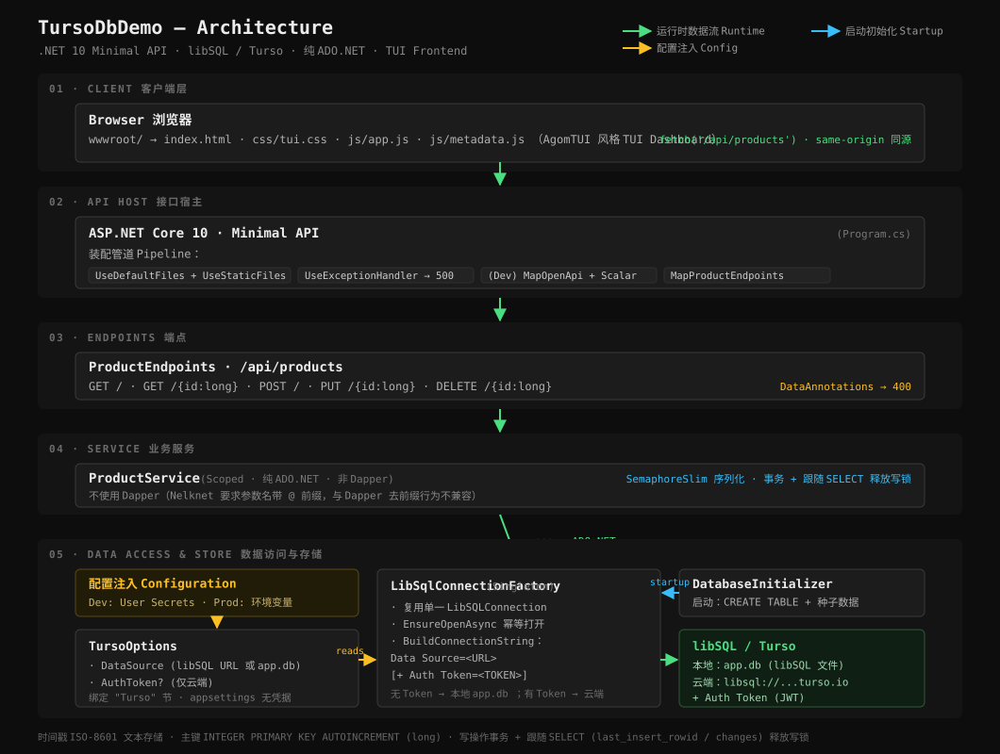

# TursoDbDemo

基于 **.NET 10 (ASP.NET Core Minimal API)** + **Turso / libSQL** 的商品 CRUD 示例项目，附带一个 AgomTUI 风格的纯前端 TUI 仪表盘。
A .NET 10 Minimal API sample for Product CRUD backed by Turso / libSQL, with a terminal-style (TUI) dashboard frontend.



## 技术栈 Tech Stack

| 层 Layer | 技术 Technology |
|----------|-----------------|
| 后端 Backend | ASP.NET Core 10 Minimal API |
| 数据库客户端 DB Client | [Nelknet.LibSQL.Data](https://www.nuget.org/packages/Nelknet.LibSQL.Data) 0.2.9（libSQL 的 ADO.NET provider） |
| 数据访问 Data Access | 纯 ADO.NET（`LibSQLConnection` / `LibSQLCommand` / `LibSQLParameter`） |
| API 文档 Docs | OpenAPI（`/openapi/v1.json`） + [Scalar](https://github.com/scalar/scalar)（开发环境 `/scalar`） |
| 前端 Frontend | 原生 HTML / CSS / JS（`wwwroot/`，AgomTUI 风格 TUI Dashboard） |
| 配置 Config | User Secrets（Dev）/ 环境变量（Prod）—— **token 不入 appsettings** |

> **为什么不用 EF Core / Dapper？** EF Core 没有官方 libSQL/Turso provider；Dapper 会强制去除参数名前缀，而 Nelknet 要求参数名带 `@` 前缀（两者不兼容）。因此本项目采用原生 ADO.NET，这是与 Nelknet 配合最稳妥的方式。

## 模块结构 Modules

| 模块 Module | 文件 File | 职责 Responsibility |
|-------------|-----------|---------------------|
| 入口 Entry | `Program.cs` | DI 注册、中间件管道、启动初始化、端点映射、全局异常处理 |
| 实体 Models | `Models/Product.cs`、`Models/ProductDtos.cs` | `Product` 实体 + 创建/更新 DTO（DataAnnotations 校验） |
| 配置 Options | `Data/TursoOptions.cs` | 绑定 `Turso` 节：`DataSource` + `AuthToken` 分离 |
| 连接工厂 Factory | `Data/LibSqlConnectionFactory.cs` | Singleton，复用单一 `LibSQLConnection`，按 DataSource + (AuthToken?) 拼接连接字符串 |
| 初始化 Init | `Data/DatabaseInitializer.cs` | 启动建表 + 首次种子数据 |
| 业务服务 Service | `Services/ProductService.cs` | Scoped，ADO.NET 实现 CRUD（信号量序列化 + 事务） |
| 端点 Endpoints | `Endpoints/ProductEndpoints.cs` | `/api/products` 路由组的 Minimal API 端点 |
| 前端 Frontend | `wwwroot/index.html`、`wwwroot/css/tui.css`、`wwwroot/js/*.js` | TUI 仪表盘，同源 `fetch('/api/products')` |

## 架构与数据流 Architecture &amp; Data Flow

```
Browser (wwwroot TUI Dashboard)
   │  fetch('/api/products')   same-origin 同源
   ▼
ASP.NET Core 10 Minimal API (Program.cs)
   UseDefaultFiles → UseStaticFiles → UseExceptionHandler → (Dev) MapOpenApi/Scalar → MapProductEndpoints
   ▼
ProductEndpoints   /api/products   (DataAnnotations 校验 → 400)
   ▼
ProductService (Scoped · 纯 ADO.NET · SemaphoreSlim 序列化)
   ▼
LibSqlConnectionFactory (Singleton · 复用单连接)  ◄── TursoOptions (DataSource + AuthToken)
   ▼                                                              ▲
libSQL / Turso                                            配置注入：Dev=User Secrets / Prod=环境变量
   · 本地 app.db   · 云端 libsql://...turso.io (+Auth Token)
```

详见顶部架构图。

## 前置条件 Prerequisites

- [.NET 10 SDK](https://dotnet.microsoft.com/)
- （可选）Turso CLI：用于创建云端数据库

## 快速开始 Quick Start

```bash
dotnet build
dotnet run
```

- 默认监听 `http://localhost:5236`（见 `Properties/launchSettings.json`），可用 `--urls http://localhost:<端口>` 覆盖。
- 首次启动自动建表并写入 3 条种子商品。
- 浏览器打开 `http://localhost:5236/` 查看 TUI 仪表盘；`/api/products` 为 JSON 接口。

## 配置：URL 与 Token 分离 Config (URL / Token split)

凭据采用 **URL 与 Token 分离** 的方式，且 **绝不写入 `appsettings.json`**：

| 字段 Field | 说明 | 本地模式 | 云端模式 |
|------------|------|----------|----------|
| `DataSource` | libSQL URL 或本地文件路径 | `app.db`（默认） | `libsql://<db>-<org>.turso.io` |
| `AuthToken` | 访问令牌（JWT），仅云端需要 | 留空 | Turso 平台生成 |

`LibSqlConnectionFactory.BuildConnectionString` 依此拼接：

- 无 `AuthToken` → `Data Source=app.db`（本地文件）
- 有 `AuthToken` → `Data Source=libsql://...turso.io;Auth Token=<token>`（云端）

### 开发环境：User Secrets（推荐）

User Secrets 只在 `Development` 环境自动加载，存储在 `%APPDATA%\Microsoft\UserSecrets\<UserSecretsId>\secrets.json`，**不进入项目目录、不入 git**。

```bash
# 初始化（csproj 已含 UserSecretsId，通常无需重复执行）
dotnet user-secrets init

# 设置 URL（非敏感，亦可放 appsettings）
dotnet user-secrets set "Turso:DataSource" "libsql://<db>-<org>.turso.io"

# 设置 Token（务必单行粘贴，勿换行；否则 key 可能错位）
dotnet user-secrets set "Turso:AuthToken" "<你的 JWT token>"
```

### 生产环境：环境变量

User Secrets 仅在 Development 加载，生产用环境变量覆盖（双下划线对应层级）：

```bash
# PowerShell
$env:Turso__DataSource  = "libsql://<db>-<org>.turso.io"
$env:Turso__AuthToken   = "<你的 JWT token>"
dotnet run
```
```bash
# bash
export Turso__DataSource="libsql://<db>-<org>.turso.io"
export Turso__AuthToken="<你的 JWT token>"
dotnet run
```

> 切回本地文件模式：清空这两个配置（`dotnet user-secrets clear` 或取消环境变量），即走默认 `app.db`。

## 创建 Turso 数据库 Create a Turso DB

```bash
# 安装 Turso CLI
brew install tursodatabase/tap/turso          # 或 curl -sSfL https://get.tur.so/install.sh | bash

turso auth login
turso db create demo-db
turso db show demo-db --url                   # libsql://demo-db-<org>.turso.io
turso db tokens create demo-db                # 输出 JWT token
```

将得到的 URL 与 token 按上文「配置」注入即可。

## API 端点 Endpoints

| 方法 Method | 路由 Route | 说明 | 成功 | 失败 |
|-------------|-----------|------|------|------|
| GET | `/api/products` | 获取全部商品 | 200 | — |
| GET | `/api/products/{id}` | 获取单个商品 | 200 | 404 |
| POST | `/api/products` | 创建商品 | 201 + Location | 400（校验） |
| PUT | `/api/products/{id}` | 更新商品 | 200 | 404 / 400 |
| DELETE | `/api/products/{id}` | 删除商品 | 204 | 404 |

### 请求示例 Example

```bash
# 创建
curl -X POST http://localhost:5236/api/products \
  -H "Content-Type: application/json" \
  -d '{"name":"显示器","description":"27 寸 4K","price":1999,"stock":30}'

# 列表
curl http://localhost:5236/api/products

# 详情
curl http://localhost:5236/api/products/1

# 更新
curl -X PUT http://localhost:5236/api/products/1 \
  -H "Content-Type: application/json" \
  -d '{"name":"显示器（升级版）","description":"32 寸 4K","price":2599,"stock":20}'

# 删除
curl -X DELETE http://localhost:5236/api/products/1
```

## 技术说明 Notes

- 时间戳以 **ISO-8601 文本**存储（libSQL/SQLite 无原生 DATETIME 类型）。
- 主键 `id` 为 `INTEGER PRIMARY KEY AUTOINCREMENT`，对应 C# 的 `long`。
- INSERT 后用同一连接的 `last_insert_rowid()` 取自增主键；UPDATE/DELETE 用 `changes()` 取受影响行数。

### Nelknet.LibSQL.Data 在本地模式下的已知行为（本项目均已规避）

详见 `Services/ProductService.cs` 与 `Data/LibSqlConnectionFactory.cs` 的注释：

1. **参数名必须带前缀**：`LibSQLParameter.ParameterName` 须以 `@` / `:` / `$` / `?` 开头，故所有 SQL 参数名显式带 `@`，且无法使用 Dapper。
2. **写操作后需重置 statement**：`ExecuteNonQueryAsync` 执行写语句后 statement 仍持写锁，直接提交会报 `database is locked`。规避方式：每条写语句后紧跟一条 `SELECT`（`last_insert_rowid()` / `changes()`）再提交事务。
3. **复用单一连接**：本地文件模式下每次 `Open()` 都会打开独立的文件句柄，多句柄交错写会触发 SQLite 文件锁。本项目在 `LibSqlConnectionFactory` 全局复用一个连接，并用信号量序列化访问（单连接非线程安全）。

> 上述 2、3 条是 Nelknet 本地文件模式（`Data Source=*.db`）下的行为；连接 Turso 云端（远程模式）时锁由服务端管理，通常无此问题。

## 安全 Security

- 凭据走 User Secrets / 环境变量，**不硬编码、不入 `appsettings.json`、不入 git**（`.gitignore` 已排除 `appsettings*.json`、`*.db`）。
- 所有 SQL 全参数化，防注入。
- 系统边界（DTO）以 DataAnnotations 校验输入。
